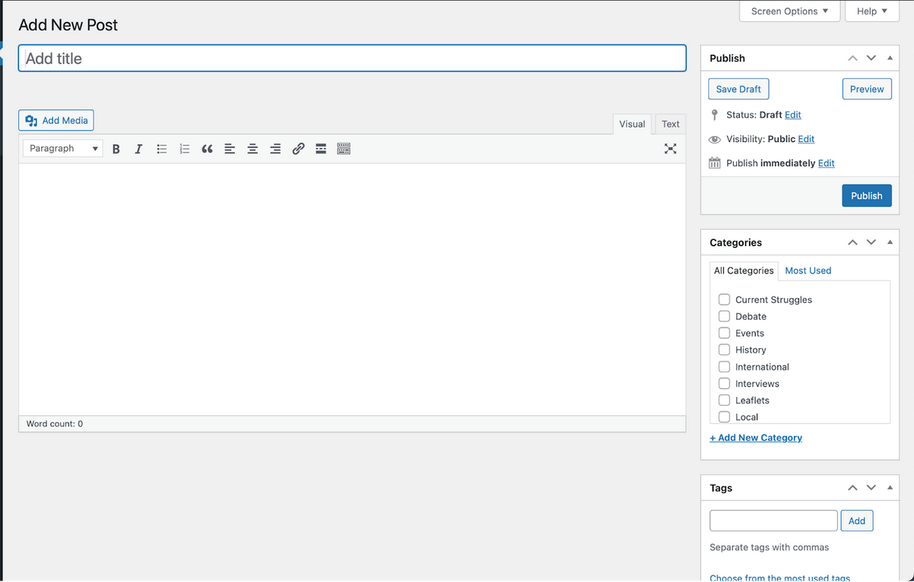

# fare-free-london

Website for the Fare Free London Campaign

## Planning

- Gathered inspiration from various sources and collected in this repo and on Are.na.
- Made moodboard in Figma
- Desktop and mobile designs in Figma
- Used [vital signs](https://www.vitalsignsmag.org/) as a base for getting going with the site. I decided I wanted to use NextJS with a Wordpress backend again and use [WPGraphQL](https://www.wpgraphql.com/) as the API.
- finished figma sketches, decided fonts.

## Building

- Edited Vital signs nextjs template.
- Replace template fonts with P22 Underground for the body and headings.
- Improved the mobile heading by making it fill the screen on opening on mobile. This gives a more polished look and prevents the user clicking in the wrong place.
- Made a favicon using a vector from [public domain vectors](https://publicdomainvectors.org), putting it through [realfavicongenerator.net](https://realfavicongenerator.net/).
- Changed the colour scheme. It was helpful to go through the template looking for customRed (using Search on all files) and replacing it with my own colours.
- Set up wordpress on admin.farefreelondon.org subdomain and Vercel on main domain: farefreelondon.org.
- The site was looking quite cold so i wanted to add some colour. I added an svg from another project I did a few years ago, with bright colourful lines. At first I wanted this at the bottom and top, but found having at the top a bit overwhelming. I kept it at the bottom and wrapped it in a component as "tubelines" - in a way it reminds me of how the old OpenAI site used to look under the footer.
- Removed frontpage component and added to index.tsx. Receiving content through Wordpress to allow client to control content.
- Used Responsively to get responsive design right - see my LinkedIn about this [here](https://www.linkedin.com/posts/jackkershaw_webdevelopment-responsivedesign-devtools-activity-7209579627588005889-Bwso?utm_source=share&utm_medium=member_desktop).
- Added a sign up form to the site. Since I was on a tight deadline from the client, I used a similar approach to the form on my [Right to the City project](https://github.com/jones58/right-to-city).
- Add back to top button, again taken from my [Right to the City project](https://github.com/jones58/right-to-city). I then edited the component as needed for this project.
- Added get involved button to the footer to drive traffic to the get involved page. I put it here because I wanted people to see it after scrolling to bottom.
- Added deploy hooks using Vercel and WP Webhooks - a Wordpress plugin. This means the site gets rebuilt when posts are created, updated or deleted on Wordpress. This provided a quick and easy way to trigger a site rebuild, without worrying about authentication or API routes.

## Debugging

- I noticed there was a bug in the mobile menu, where clicking on a link for a page you're already on didn't make it go away - I fixed this by adding an onClick event handler to each link to set the menuOpen state to false.
- Some users were reporting slow loading times. I used unlighthouse to check the speed of the site.
  - Switched to the next/image component to set the appropriate sizes.
  - Switched footer image to low priority
  - Preconnect to va.vercel-scripts.com to speed up the site.
  - NextJS recommends optional 'sharp' package for image optimisation, so I installed it.
    Read more: https://nextjs.org/docs/messages/sharp-missing-in-production
  - All these things improved LCP from 11.3s to 2.8s, bringing Performance score up from 67 to 96.
- NextJS told me there was an issue with using a legacy prop, "layout", on images so i changed this, to use width and height with object-cover instead.
- Used [NextJS docs](https://nextjs.org/docs/pages/building-your-application/configuring/debugging) for further debugging on both the server and client sides. In particular, the VScode debugging option was very useful.
  - Used this to add the priority property to the banner image, as it was identified as part of the LCP.
- There was an issue with builds on Vercel where sometimes the whole site would end up blank (at least requiring a reload), and i'd have to redeploy. I fixed this by changing the details in the package.json as instructed in[this tutorial](https://www.youtube.com/watch?v=U89A0l6AM18). This didn't seem to fix it, so I used a generic .htaccess file to fix it instead.
- The back to top button wasn't a circle, instead appearing as a circle so I fixed this by:
  - Setting the width and height of the button to 16 to make it a circle.
  - Used flex, items-center, and justify-center to center the icon inside the button.
  - Setting the width and height of the icon to 6 to make it fit well within the button.
- Edited the Get Involved button in the footer to fit with the rest of the social icons in footer.
- Ran unlighthouse on the site again.
  - Reccommended to make links not rely on just colour to be distinguishable, since link text that is discernible improves the experience for users with low vision. I added an underline with an offset of 2 to all links, except header and footer links which are more self explanatory and do not need to be distinguishable.
  - Told me to add titles to social share links. I also converted these to NextJS links to improve performance.
  - Unlighthouse showed me that alt text wasn't loading for images on the news page (post previews). I fixed this by passing the necessary alt text to the post preview and cover imagfe components.
  - Said the front page was running slow - including LCP so I worked on lowering this with:
    - Preload key resources (the image here) for fast loading
    - Adding caching for static assets (favicon and fonts) to my next.config.js.
- Added name to site webmanifest.
- Added to Google Search Console to enable tracking of SEO performance.
- Improved SEO with:
  - Keywords in meta tags
  - Adding title to main page.
  - verifying robots.txt
  - adding robots and author meta tags.
  - added canonical tags
- There was an issue where alt text wasn't showing for images on the news page (and the subpages: posts themselves). I tried several solutions, including tidying how props are passed to components, but in the end it was a case of editing the API so a query returned alt text for images on the news page.
- On the Supporters page, I had some issues with getting the layout right on desktop. I realised that the content could be split into divs by h2, so I processed the content into separate divs by the h2 element.
- A member of the public (thanks ruthkonyn!) added [an issue](https://github.com/jones58/fare-free-london/issues/1) to this repository (since the github url is on the site), which I fixed by centring the text on the aims page for better readability on desktop.
- Added colours for subheadings (dark blue)
- Disabled animations on the site using lazymotion to lazy load them based on the DOM.

# Running on your machine

## Run the Frontend (Next.js) in development mode:

```bash
npm install
npm run dev
```

## How To Edit This Site in Wordpress

(This is a copy of the text I sent to the client to help them edit the site)

### Intro

- The basic structure of the site is built in Wordpress - all the content for the articles and the pages is stored there.

- On top of this, I've made a custom design for displaying the content well, making it interactive and including colours, fonts and animations. You can see this on farefreelondon.org What’s on here can’t be edited directly, but you can send me an email on jackkershaw@protonmail.com and I'll see what I can do. I plan to make a few edits to it Thursday onwards.

### Editing the site

- To edit the site, you’ll need to go to the following link: https://admin.farefreelondon.org/wp-admin/ and login with the credentials provided.

- You’ll be greeted by a dashboard screen, which you can ignore. You need to find the “posts” section on the sidebar. Here, you can edit the articles which fill the latest news page.


From here it is very easy to create new posts, just click the “add new post” button and a dialog box will come up. Other than formatting, making a post is very easy and requires little in the way of designing content.



- Add a title
- Add content
- Add an excerpt (this is one sentence about the article - can just be the first line from the article – which will be displayed on the news page). If more than one sentence is written, it will get clipped automatically to one sentence.
- Add a featured image - this is the image that will show on the homepage, as well as at the top of the article. Landscape images work best here. Make sure to add alt text, for accessibility reasons. There’s a good guide [here](https://design102.blog.gov.uk/2022/01/14/whats-the-alternative-how-to-write-good-alt-text/).

- Separate from the "posts" icon, you will find another called "pages". Inside this, you will find the frontpage, aims, and get involved pages.


- Frontpage - This can be edited in a similar way to posts/articles, and has a featured image that can be changed. Changes are reflected on the main page: farefreelondon.org.

- The same process goes for the get involved and aims pages - they are edited in the same way. For now, these have featured images but they won’t show up on the live site(I’ll work on editing this when I’m back from holiday).

### Form Submissions

These are set up to come through on Airtable, and can be accessed via the url.

If you have any other questions about editing the site or getting form submissions, please feel free to email me on jackkershaw@protonmail.com.
